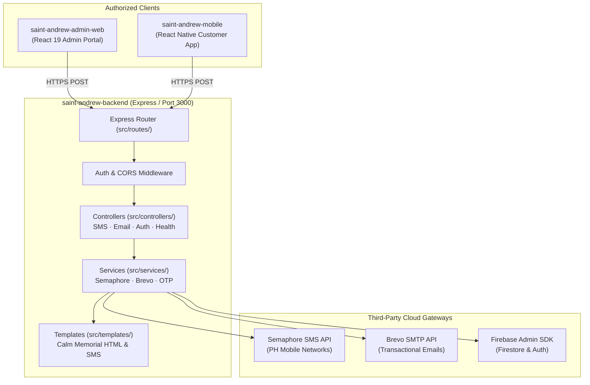

# System Architecture: St. Andrew Funeral Home Backend Microservice

**Service Name:** `saint-andrew-backend`  
**Runtime:** Node.js (v18+) / Express  
**Deployment Target:** Render Web Service (via `render.yaml`)  
**Shared Infrastructure:** Firebase Project `saint-andrew-funeral-home` (Admin SDK)

---

## 1. Architectural Overview & System Boundary

The **Saint Andrew Backend** is a dedicated, stateless transactional microservice. It decouples external SMS, email, and cryptographic OTP operations from client applications (`saint-andrew-admin-web` and `saint-andrew-mobile`).



---

## 2. Clean Layered Directory Structure

```text
saint-andrew-backend/
├── render.yaml               # Render Web Service Blueprint (root-level deployment)
├── package.json              # Service dependencies (express, cors, dotenv, axios, firebase-admin)
├── .env.example              # Environment variable contract
├── .gitignore                # Protects secrets & logs
├── start-backend.ps1         # Windows dev supervisor script
├── test.js                   # Endpoint sanity test script
└── src/
    ├── app.js                # Express app configuration & middleware pipeline
    ├── index.js              # Server lifecycle & port binding (default 3000)
    ├── config/
    │   ├── env.config.js     # Validated environment configuration with fallback defaults
    │   └── firebase.config.js# Firebase Admin SDK initialization & Firestore instance
    ├── controllers/
    │   ├── auth.controller.js   # OTP request, verify, and password reset handler
    │   ├── email.controller.js  # Customer support contact email intake
    │   ├── health.controller.js # Service health diagnostics & Brevo connection status
    │   └── sms.controller.js    # Balance reminder SMS handler & transaction audit
    ├── middleware/
    │   ├── auth.middleware.js   # Bearer token verification & optional dev bypass
    │   ├── cors.middleware.js   # Dynamic CORS header resolution
    │   ├── error.middleware.js  # Centralized error handler & 404 router
    │   └── logger.middleware.js # Structured request logging
    ├── routes/
    │   ├── auth.routes.js       # /send-otp-email, /verify-otp, /send-password-reset
    │   ├── email.routes.js      # /send-support-email
    │   ├── health.routes.js     # /, /test-brevo
    │   ├── sms.routes.js        # /send-balance-sms
    │   └── index.js             # Master route aggregator
    ├── services/
    │   ├── brevo.service.js     # Brevo transactional email client
    │   ├── otp.service.js       # Cryptographic OTP generation & Firestore storage
    │   └── semaphore.service.js # Semaphore SMS gateway client (+ simulated mode)
    └── templates/
        ├── email.templates.js   # Calm Memorial branded HTML emails
        └── sms.templates.js     # Respectful balance reminder text formatters
```

---

## 3. Core Service Contracts & API Endpoints

### 3.1 Health & Diagnostics
| Method | Path | Description | Response |
|---|---|---|---|
| `GET` | `/` | Service health, mode, and integration status | `{ status: "online", version: "2.0.0", services: { ... } }` |
| `GET` | `/test-brevo` | Verifies Brevo SMTP API connectivity | `{ success: true, message: "Brevo connected" }` |

### 3.2 SMS Gateway (Semaphore)
| Method | Path | Payload | Behavior |
|---|---|---|---|
| `POST` | `/send-balance-sms` | `{ phone, clientName, deceasedName, balance, dueDate, transactionId? }` | Normalizes PH phone (`09...` or `+63...`), sends respectful balance SMS, audits dispatch in Firestore if `transactionId` provided. |

### 3.3 Transactional Email (Brevo)
| Method | Path | Payload | Behavior |
|---|---|---|---|
| `POST` | `/send-support-email` | `{ name, email, phone?, subject, message }` | Dispatches customer support inquiry to funeral home staff mailbox with Calm Memorial HTML layout. |
| `POST` | `/send-otp-email` | `{ email }` | Generates 6-digit cryptographic OTP, writes to `/password_reset/{email}` in Firestore, sends branded email. |
| `POST` | `/verify-otp` | `{ email, otp }` | Validates OTP against Firestore, enforces 15-minute expiration, returns verification token. |
| `POST` | `/send-password-reset` | `{ email }` | Triggers Firebase Auth password reset email for registered account. |

---

## 4. Engineering & Operational Standards

### 4.1 Fallback & Simulation Discipline
- If `SEMAPHORE_API_KEY` is not set or in local development, the service **simulates** SMS delivery by logging formatted messages to stdout rather than failing.
- If `FIREBASE_SERVICE_ACCOUNT_JSON` is missing, the service attempts to load a local `service-account.json` file. If unavailable, it warns gracefully without crashing health checks.

### 4.2 Centralized Error Pipeline
Every async route handler is wrapped with an error boundary. Unhandled rejections are intercepted by [`src/middleware/error.middleware.js`](src/middleware/error.middleware.js) and returned as standard JSON:
```json
{
  "success": false,
  "error": "Human-readable error description"
}
```

### 4.3 Production Deployment
Render reads [`render.yaml`](render.yaml) directly from the repository root:
- Automatic deploy on push to `main`
- Zero external build tool dependencies (pure Node.js)
