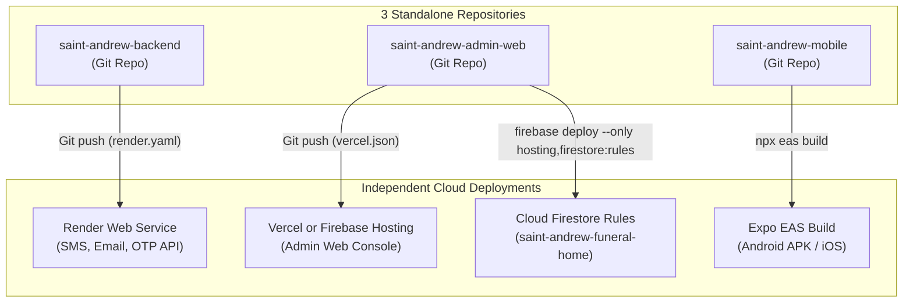

# Production Deployment Guide: St. Andrew Funeral Home

This guide covers deploying each of the **3 standalone repositories**:



---

## 1. Backend Microservice (`saint-andrew-backend`) ➔ Render

The backend microservice handles Semaphore SMS, Brevo transactional emails, and OTP verification.

### Option A: Using Render Blueprint (`render.yaml`) — Automatic
1. In your [Render Dashboard](https://dashboard.render.com), click **New +** ➔ **Blueprint**.
2. Connect your **`saint-andrew-backend`** repository.
3. Render automatically detects `render.yaml` at the repository root.
4. Input your environment secrets when prompted.

### Option B: Manual Web Service Setup
* **Name**: `saint-andrew-backend`
* **Root Directory**: `.` (leave default)
* **Environment**: `Node`
* **Build Command**: `npm install`
* **Start Command**: `npm start`
* **Health Check Path**: `/`

### Required Environment Variables
| Variable | Value / Description | Secret? |
|---|---|---|
| `PORT` | `3000` (or leave default, Render injects `PORT`) | No |
| `NODE_ENV` | `production` | No |
| `SEMAPHORE_API_KEY` | Semaphore API token for SMS | Yes |
| `BREVO_API_KEY` | Brevo SMTP API key (`xkeysib-...`) | Yes |
| `BREVO_SENDER_EMAIL` | Verified Brevo sender email | No |
| `FIREBASE_SERVICE_ACCOUNT_JSON` | Minified raw JSON string of Firebase service account | Yes |

---

## 2. Admin Web Portal (`saint-andrew-admin-web`) ➔ Vercel or Firebase Hosting

### Option A: Vercel (Recommended for Fastest Global CDN)
1. Go to [Vercel Dashboard](https://vercel.com/dashboard) and click **Add New...** ➔ **Project**.
2. Select your **`saint-andrew-admin-web`** repository.
3. Framework preset is automatically detected as **Vite**:
   - **Root Directory**: `.` (repository root)
   - **Build Command**: `npm run build`
   - **Output Directory**: `dist`
4. Client-side routing rewrites are handled by `vercel.json`.

#### Required Environment Variables in Vercel:
```env
VITE_FIREBASE_API_KEY=your_api_key_here
VITE_FIREBASE_AUTH_DOMAIN=saint-andrew-funeral-home.firebaseapp.com
VITE_FIREBASE_PROJECT_ID=saint-andrew-funeral-home
VITE_FIREBASE_STORAGE_BUCKET=saint-andrew-funeral-home.firebasestorage.app
VITE_FIREBASE_MESSAGING_SENDER_ID=your_messaging_sender_id
VITE_FIREBASE_APP_ID=your_web_app_id
VITE_FIREBASE_MEASUREMENT_ID=your_measurement_id
VITE_SMS_BACKEND_URL=https://your-backend-app.onrender.com
```

---

### Option B: Firebase Hosting (Same Firebase Project)
The repository contains `firebase.json` configured to host `dist`.

1. Inside `saint-andrew-admin-web`, build the production bundle:
   ```bash
   npm run build
   ```
2. Deploy to Firebase:
   ```bash
   firebase deploy --only hosting
   ```

---

## 3. Database Security Rules ➔ Cloud Firestore

Deploy security rules whenever `firestore.rules` is updated:

```bash
# Run inside saint-andrew-admin-web:
firebase deploy --only firestore:rules
```

---

## 4. Customer Mobile App (`saint-andrew-mobile`) ➔ Expo EAS

Mobile apps compile into native binaries via EAS:

1. Inside `saint-andrew-mobile`:
   ```bash
   npx eas login
   ```
2. Generate standalone Android test APK:
   ```bash
   npx eas build --platform android --profile preview
   ```
3. Generate production build (Google Play AAB / Apple App Store IPA):
   ```bash
   npx eas build --platform all --profile production
   ```

---

## 5. Deployment Verification Checklist

- [ ] **Backend Health**: `GET https://your-backend.onrender.com/` returns `{"status":"online"}`.
- [ ] **SMS Test**: `POST /send-balance-sms` delivers SMS via Semaphore gateway.
- [ ] **Email Test**: `GET /test-brevo` or support email routes successfully send emails via Brevo.
- [ ] **Admin Web Auth**: Logging into the admin portal validates staff role in Firestore.
- [ ] **CORS**: Requests from `https://your-admin-domain.vercel.app` to the Render backend pass with status `200`.
