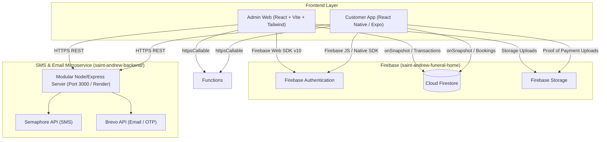

# Funeral System: Complete Menu, Data, API, Collections, and Conversion Reference

Scope: St. Andrew Funeral Home Modernization  
Source Project: `C:\Users\jomadlcrz\Desktop\Saint-Andrew-Funeral-Home`  
Target Project: `C:\Users\jomadlcrz\Desktop\Saint-Andrew-Funeral-Home`  
Shared Firebase Project: `saint-andrew-funeral-home`  
SMS/Email Microservice: `saint-andrew-backend/` (`http://localhost:3000` / Render)

---

## 1. System Boundary & Infrastructure Architecture

The objective is to modernize the frontends into **React.js (Admin Web)** and **React Native / Expo (Customer Mobile)** while connecting to the shared Firebase and modular backend microservice:



---

## 2. Firebase Configuration & Security Rules

### 2.1 Web & Mobile Client Configuration
```typescript
export const firebaseConfig = {
  apiKey: "your_api_key_here",
  authDomain: "saint-andrew-funeral-home.firebaseapp.com",
  projectId: "saint-andrew-funeral-home",
  storageBucket: "saint-andrew-funeral-home.firebasestorage.app",
  messagingSenderId: "your_messaging_sender_id",
  appId: "your_web_app_id",
  measurementId: "your_measurement_id"
};
```

### 2.2 Security Rules Breakdown (`firestore.rules`)
```javascript
rules_version = '2';
service cloud.firestore {
  match /databases/{database}/documents {
    function isSignedIn() {
      return request.auth != null;
    }

    function isAdmin() {
      return isSignedIn()
        && get(/databases/$(database)/documents/users/$(request.auth.uid)).data.role == 'admin';
    }

    // Public OTP storage for forgot-password
    match /password_reset/{email} {
      allow read, write: if true;
    }

    // User accounts
    match /users/{userId} {
      allow read, write: if request.auth.uid == userId;
      // Allow phone lookup for login without prior auth
      allow read: if request.query.limit <= 1 && 'phone' in request.query.where;
    }

    // Transaction confirmations
    match /confirmations/{docId} {
      allow read, write: if isSignedIn();
    }

    // Transaction orders & service contracts
    match /transactions/{docId} {
      allow read, write: if isSignedIn();
    }

    // Public promotions
    match /promotions/{docId} {
      allow read: if true;
      allow write: if isAdmin();
    }

    // Inventory & casket packages
    match /inventory/{docId} {
      allow read: if isSignedIn();
      allow write: if isAdmin();
    }

    // Support chat threads & messages
    match /support_chats/{chatId} {
      allow read, write: if isAdmin() || (isSignedIn() && request.auth.uid == chatId);

      match /messages/{messageId} {
        allow read, write: if isAdmin() || (isSignedIn() && request.auth.uid == chatId);
      }
    }

    // Administrative scheduling tasks
    match /admin_schedule_tasks/{docId} {
      allow read, write: if isSignedIn();
    }

    match /{document=**} {
      allow read, write: if false;
    }
  }
}
```

---

## 3. Detailed Firestore Collections & Document Schemas

### 3.1 `users` Collection
- **Path**: `/users/{uid}`
- **Purpose**: Stores account metadata for both staff administrators and customer clients.
- **Fields**:
  | Field | Type | Description |
  |---|---|---|
  | `uid` | string | Matches Firebase Auth UID |
  | `fullName` | string | Full legal name |
  | `email` | string | Email address |
  | `phone` | string | Philippine mobile number (e.g., `09XXXXXXXXX`) |
  | `role` | string | `'admin'` or `'user'` |
  | `status` | string | `'active'`, `'inactive'`, or `'suspended'` |
  | `address` | string | Residential / delivery address |
  | `photoURL` | string | Profile picture download URL (Firebase Storage or base64 data URL fallback) |
  | `createdAt` | Timestamp | Account creation timestamp |
  | `updatedAt` | Timestamp | Last modified timestamp |

### 3.2 `transactions` Collection
- **Path**: `/transactions/{transactionId}`
- **Purpose**: Core records of funeral contracts, packages, custom arrangements, and walk-in purchases.
- **Fields**:
  | Field | Type | Description |
  |---|---|---|
  | `userId` | string | Client UID or `'walk-in'` |
  | `clientName` | string | Name of client / organizer |
  | `clientEmail` | string | Contact email |
  | `clientPhone` | string | Contact phone |
  | `deceasedName` | string | Name of the deceased |
  | `dateOfDeath` | string / Timestamp | Date of passing |
  | `serviceType` | string | Package name or custom arrangement description |
  | `selectedItems` | array / map | Casket, urn, florals, hearse selection |
  | `totalPrice` | number | Total contract amount (PHP) |
  | `amountPaid` | number | Cumulative amount paid so far |
  | `balance` | number | Remaining balance (`totalPrice - amountPaid`) |
  | `paymentStatus` | string | `'unpaid'`, `'partial'`, or `'paid'` |
  | `status` | string | `'pending'`, `'accepted'`, `'approved'`, `'in_progress'`, `'completed'`, `'cancelled'`, `'rejected'` |
  | `proofOfPaymentUrl`| string | Firebase Storage URL for customer payment receipts |
  | `isWalkIn` | boolean | `true` if initiated by admin for on-site walk-in customer |
  | `burialDate` | Timestamp / string | Scheduled interment/cremation date |
  | `notes` | string | Special arrangement instructions or administrative notes |
  | `createdAt` | Timestamp | Submission timestamp |
  | `updatedAt` | Timestamp | Last updated timestamp |

### 3.3 `inventory` Collection
- **Path**: `/inventory/{itemId}`
- **Purpose**: Catalog of physical goods and standard service tiers.
- **Fields**:
  | Field | Type | Description |
  |---|---|---|
  | `name` | string | Product/service name |
  | `category` | string | `'caskets'`, `'urns'`, `'flowers'`, `'vehicles'`, `'packages'`, `'services'` |
  | `description` | string | Material details, finish, dimensions |
  | `price` | number | Price in PHP |
  | `stock` | number | Available quantity in warehouse |
  | `available` | boolean | Availability flag (`stock > 0`) |
  | `imageUrl` | string | Storage or hosted image URL |
  | `features` | array | List of bullet-point inclusions |
  | `createdAt` | Timestamp | Creation timestamp |

### 3.4 `promotions` Collection
- **Path**: `/promotions/{promoId}`
- **Purpose**: Special seasonal offers and package discounts.
- **Fields**:
  | Field | Type | Description |
  |---|---|---|
  | `title` | string | Promo headline |
  | `description` | string | Terms and details |
  | `discountType`| string | `'percentage'` or `'fixed'` |
  | `discountValue`| number| Numeric discount (e.g. `10` for 10% or `5000` for ₱5,000 off) |
  | `code` | string | Coupon promo code (optional) |
  | `startDate` | Timestamp | Active from date |
  | `endDate` | Timestamp | Expiration date |
  | `isActive` | boolean | Visibility toggle |
  | `imageUrl` | string | Promotional banner image |

### 3.5 `support_chats` & Subcollection `messages`
- **Path**: `/support_chats/{chatId}` (where `chatId` is the customer's UID)
- **Subcollection**: `/support_chats/{chatId}/messages/{messageId}`
- **Fields (`support_chats`)**:
  | Field | Type | Description |
  |---|---|---|
  | `userId` | string | Customer UID |
  | `userName` | string | Customer name |
  | `userEmail` | string | Customer email |
  | `userPhoto` | string | Customer profile picture URL, denormalized from `users/{uid}` |
  | `lastMessage` | string | Preview of most recent chat message |
  | `lastMessageTime`| Timestamp | Timestamp of last message |
  | `unreadAdminCount`| number | Counter for staff notifications |
  | `unreadUserCount` | number | Counter for client notifications |
- **Fields (`messages`)**:
  | Field | Type | Description |
  |---|---|---|
  | `senderId` | string | UID of message sender |
  | `senderRole`| string | `'admin'` or `'user'` |
  | `text` | string | Message body |
  | `timestamp`| Timestamp | Server timestamp |
  | `read` | boolean | Read receipt |

### 3.6 `admin_schedule_tasks` Collection
- **Path**: `/admin_schedule_tasks/{taskId}`
- **Purpose**: Operational calendar for viewings, vigils, transport, and cemetery interments.
- **Fields**:
  | Field | Type | Description |
  |---|---|---|
  | `title` | string | Event title (e.g., "Interment Service - Dela Cruz") |
  | `description` | string | Event notes and location |
  | `date` | string / Timestamp | Event date |
  | `startTime` | string | Event start time (e.g., "09:00 AM") |
  | `endTime` | string | Event end time (e.g., "11:30 AM") |
  | `type` | string | `'viewing'`, `'interment'`, `'cremation'`, `'consultation'`, `'maintenance'` |
  | `assignedTo` | string | Staff member or driver assigned |
  | `transactionId`| string | Associated transaction ID (optional) |
  | `status` | string | `'scheduled'`, `'in_progress'`, `'completed'`, `'cancelled'` |

### 3.7 `password_reset` Collection
- **Path**: `/password_reset/{email}`
- **Purpose**: Ephemeral OTP storage for verification.
- **Fields**:
  | Field | Type | Description |
  |---|---|---|
  | `otp` | string | 6-digit numeric verification code |
  | `createdAt` | Timestamp | Time code was issued (15-minute TTL) |

---

## 4. Backend Microservice REST API Reference

All transactional communication (SMS, Brevo emails, OTP, password recovery) is served by the modular Express microservice located in `saint-andrew-backend/`. Client-side phone lookup is queried directly via Firestore (`where("phone", "==", phone).limit(1)`).

### 4.1 `saint-andrew-backend/` REST API Endpoints
Base URL: `http://localhost:3000` (Local) / `https://<service-name>.onrender.com` (Production)

| Method | Endpoint | Headers | Request Body | Description |
|---|---|---|---|---|
| `GET` | `/` | None | None | Health check & services status JSON |
| `POST` | `/send-balance-sms` | `Authorization: Bearer <token>` | `{ phone, clientName, deceasedName, balance, dueDate }` | Sends SMS via Semaphore (simulated if key unset) |
| `POST` | `/send-support-email` | `Content-Type: application/json` | `{ name, email, subject, message }` | Sends support inquiry to staff via Brevo |
| `POST` | `/send-otp-email` | `Content-Type: application/json` | `{ email }` | Sends 6-digit password reset OTP via Brevo |
| `POST` | `/verify-otp` | `Content-Type: application/json` | `{ email, otp }` | Validates submitted OTP (15-min expiry window) |
| `POST` | `/send-reset-link` | `Content-Type: application/json` | `{ email }` | Generates Firebase password reset link and emails it |
| `GET` | `/test-brevo` | None | None | Brevo account connection & credit diagnostic |

---

## 5. UI / UX Design Tokens ("Calm Memorial")

| Token | Hex | Tailwind Equivalent | Role |
|---|---|---|---|
| **`ink`** | `#1F3A5F` | `bg-[#1F3A5F]`, `text-[#1F3A5F]` | Primary brand navy; navbars, primary CTAs, main titles |
| **`inkSoft`** | `#2C4B66` | `bg-[#2C4B66]`, `text-[#2C4B66]` | Secondary navy; sub-navigation, secondary headers |
| **`inkDeep`** | `#152A45` | `bg-[#152A45]` | Darkest navy; admin sidebar and high-contrast rails |
| **`brass`** | `#B08D57` | `border-[#B08D57]`, `text-[#B08D57]` | Warm brass accent; active states, highlights, primary badge borders |
| **`brassSoft`**| `#D8C3A5` | `bg-[#D8C3A5]` | Soft brass tint; chip surfaces and gentle selection fills |
| **`paper`** | `#F3EFE8` | `bg-[#F3EFE8]` | Warm textured off-white; main app page background |
| **`linen`** | `#FBF9F5` | `bg-[#FBF9F5]` | Clean surface; cards, modals, table rows |
| **`stone`** | `#64748B` | `text-[#64748B]` | Slate gray; metadata, muted descriptions, inactive icons |
| **`outline`** | `#E2E0D8` | `border-[#E2E0D8]` | Hairline borders (1px) |
| **`evergreen`**| `#2E6B5E` | `text-[#2E6B5E]`, `bg-[#2E6B5E]/10` | Calm success indicator; Paid, Active, Verified, Completed |
| **`clay`** | `#C56A52` | `text-[#C56A52]`, `bg-[#C56A52]/10` | Gentle alert/danger; Cancelled, Overdue, Warning, Delete |
| **`teal`** | `#2FA8A0` | `text-[#2FA8A0]` | Admin data-viz and chart series |

### Typography Scale
- **Display Serif**: `Cormorant Garamond` (Hero headers, brand headlines, section title cards).
- **Body Sans**: `Inter` (Data tables, forms, buttons, mobile listings, body copy).

---

## 6. Menu and Route Ownership

### 6.1 Admin Web Console (`admin-web/`)

| Sidebar Item | Frontend Route | Purpose |
|---|---|---|
| **Dashboard** | `/dashboard` | Metrics overview (revenue, pending bookings, active services, task calendar) |
| **Transactions** | `/transactions` | Filterable list of all customer contracts, payment tracking, balance SMS triggers |
| **Walk-in Transaction** | `/walk-in` | Dedicated wizard for in-person clients to select inventory and generate contracts |
| **Inventory Management**| `/inventory` | Stock levels, price editing, package inclusions, stock replenishment |
| **Sales & Promotions** | `/promotions` | Creating and managing banner offers and discount codes |
| **User Management** | `/users` | Customer accounts, staff roles, account activation/deactivation |
| **Support Chat** | `/support` | Live two-way chat with customer accounts |
| **Calendar Schedule** | `/calendar` | Scheduled services, wake viewings, cremation and interment slots |

### 6.2 Customer Mobile App (`customer-mobile/`)

| Screen / Flow | Route / Navigation Name | Purpose |
|---|---|---|
| **Home / Landing** | `(tabs)/index` | Welcome banner, quick access to services, emergency hotline |
| **Catalog & Packages**| `(tabs)/catalog` | Browse caskets, urns, complete packages, and floral arrangements |
| **Arrangement Wizard** | `booking/wizard` | Step-by-step funeral plan builder (casket, service, dates, details) |
| **My Arrangements** | `(tabs)/orders` | Active and past service contracts, payment status, remaining balance |
| **Payment Upload** | `orders/upload-proof` | Upload GCash receipt screenshot to Firebase Storage (cash is recorded by the office) |
| **Support Chat** | `(tabs)/chat` | Direct messaging with funeral home staff |
| **Notifications** | `notifications` | Status updates, balance reminders, schedule confirmations |
| **Profile** | `(tabs)/profile` | Contact info, password management, help & FAQ |

---

## 7. Client-Side Business Logic Synchronization

Because no changes are made to the backend, the client applications are responsible for preserving key business rules:

1. **Transaction -> Inventory Decrement**:
   - When an admin marks a transaction status as `'approved'` or creates a walk-in transaction, the client executes a Firestore transaction updating both:
     ```javascript
     const transactionRef = doc(db, 'transactions', txnId);
     const inventoryRef = doc(db, 'inventory', itemId);
     
     await runTransaction(db, async (transaction) => {
       const invDoc = await transaction.get(inventoryRef);
       const currentStock = invDoc.data().stock || 0;
       if (currentStock <= 0) throw new Error("Item out of stock");
       
       transaction.update(inventoryRef, { stock: currentStock - 1, available: (currentStock - 1) > 0 });
       transaction.update(transactionRef, { status: 'approved' });
     });
     ```
2. **Transaction Balance Calculation**:
   - `balance = Math.max(0, totalPrice - amountPaid)`
   - `paymentStatus = (amountPaid <= 0) ? 'unpaid' : (amountPaid >= totalPrice) ? 'paid' : 'partial'`
3. **Admin Role Gating**:
   - Upon sign-in, read `/users/{uid}`.
   - If `role !== 'admin'` or `status !== 'active'`, trigger `signOut(auth)` and render an access-denied view.
